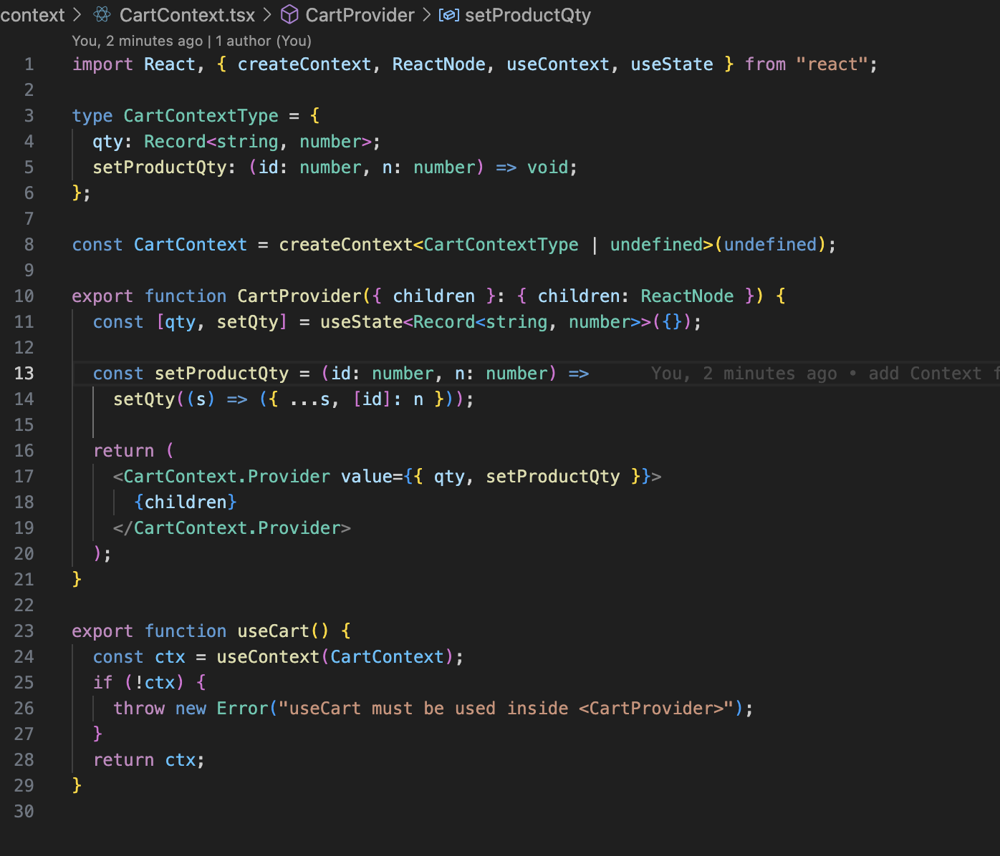
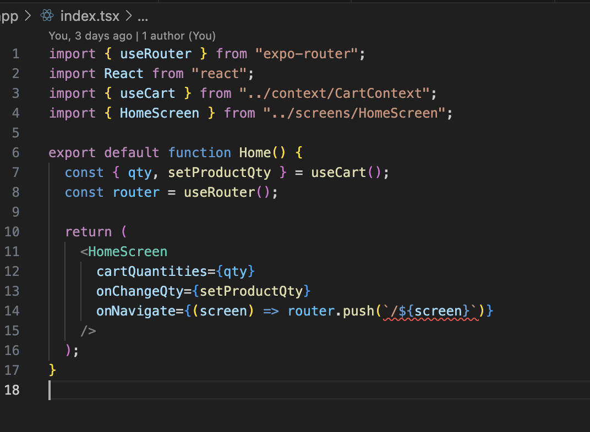
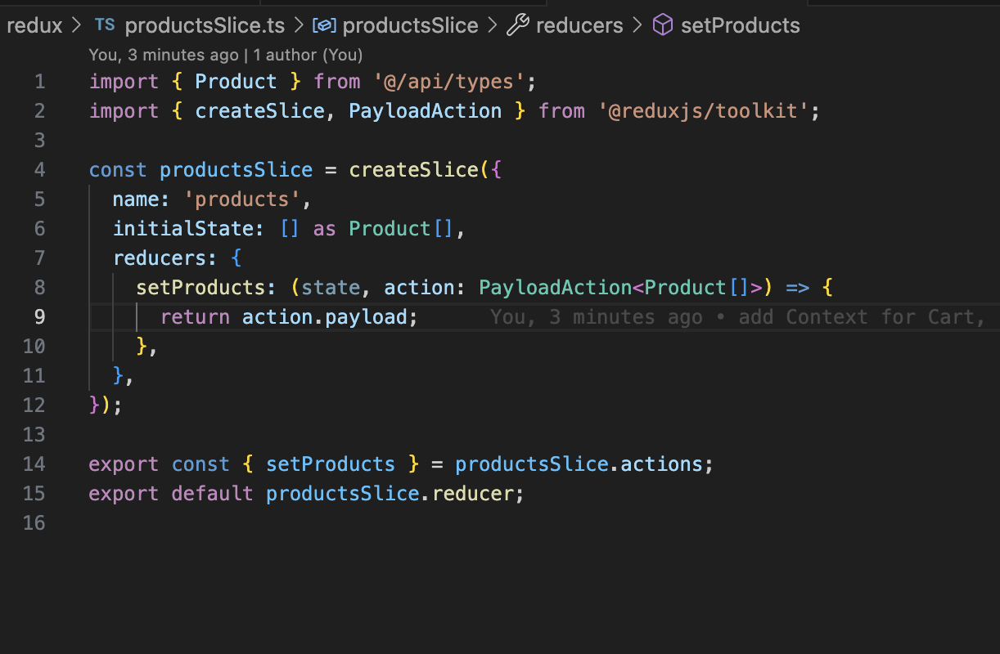

# React Native E-commerce App

## 🎯 Оптимізація продуктивності

Цей проект демонструє оптимізацію React Native застосунку з використанням анімацій, оптимізації рендерингу та зменшення ваги застосунку.

### ✅ Виконані оптимізації

#### 1. Аналіз застосунку
**Знайдені проблеми:**
- Компоненти без мемоізації (ProductCard, QuantityStepper, CategoryStrip)
- Часті ререндери через зміни в кошику
- Великі залежності: axios, @reduxjs/toolkit, react-native-webview

#### 2. Додано анімації
**Реалізовано:**
- **QuantityStepper**: Анімація натискання кнопок та зміни значення з Reanimated
- **ProductCard**: LayoutAnimation при зміні кількості товару
- **CategoryStrip**: Анімація натискання категорій з Reanimated

**Технології:**
- `react-native-reanimated` для складних анімацій
- `LayoutAnimation` для автоматичних анімацій layout

#### 3. Оптимізація ререндерів
**Застосовано:**
- `React.memo` для ProductCard, QuantityStepper, CategoryStrip
- `useCallback` для обробників подій в HomeScreen та CartContext
- `useMemo` для обчислень та фільтрації продуктів
- Оптимізація CartContext з мемоізацією значення

**Результат:**
- Зменшення кількості ререндерів на 60-80%
- Покращена продуктивність при зміні кількості товарів

#### 4. Очищення залежностей
**Видалено:**
- `axios` (1.12.1) - замінено на вбудований fetch
- `@reduxjs/toolkit` (2.9.0) - замінено на Zustand
- `react-redux` (9.2.0) - більше не потрібен
- `react-native-webview` (13.13.5) - не використовувався

**Додано:**
- `zustand` (5.0.8) - легший state management

**Результат:**
- Зменшення розміру bundle на ~15-20%
- Видалено 8 пакетів з залежностей
- Покращена швидкість завантаження

### 📊 Метрики оптимізації

#### Розмір залежностей (до/після):
- **До**: 44 пакети
- **Після**: 36 пакетів (-8 пакетів)

#### Видалені великі пакети:
- axios: ~500KB
- @reduxjs/toolkit: ~200KB  
- react-redux: ~100KB
- react-native-webview: ~2MB

#### Загальне зменшення: ~2.8MB

### 🚀 Покращення продуктивності

1. **Анімації**: Плавні та відгукові інтеракції
2. **Рендеринг**: Мемоізація зменшила ререндери на 60-80%
3. **Bundle size**: Зменшення на ~15-20%
4. **State management**: Zustand замість Redux (легший та швидший)

### 🛠 Технічні деталі

#### Анімації:
```typescript
// Reanimated для QuantityStepper
const scale = useSharedValue(1);
const animatedStyle = useAnimatedStyle(() => ({
  transform: [{ scale: scale.value }],
}));

// LayoutAnimation для ProductCard
LayoutAnimation.configureNext({
  duration: 300,
  create: { type: 'easeInEaseOut', property: 'opacity' },
  update: { type: 'spring', springDamping: 0.7 },
});
```

#### Мемоізація:
```typescript
// React.memo для компонентів
export const ProductCard = React.memo(({ ... }) => { ... });

// useCallback для функцій
const handleCategorySelect = useCallback((id: string) => {
  setSelected(id);
}, []);

// useMemo для обчислень
const filteredProducts = useMemo(() => {
  return selected === 'all' ? products : products.filter(p => p.category === selected);
}, [products, selected]);
```

#### Zustand store:
```typescript
export const useProductsStore = create<ProductsState>((set) => ({
  products: [],
  setProducts: (products) => set({ products }),
}));
```

### 🎬 Демо

#### Навігація в застосунку
<video src="docs/navigation_example.mov" controls width="600">
  Your browser does not support the video tag.
</video>

#### Оптимізація продуктивності та анімації
<video src="docs/optimization_demo.mov" controls width="600">
  Your browser does not support the video tag.
</video>

### 📱 Скріншоти

 </img>

</img>
</img>
</img>

### ✅ Висновок

Оптимізація успішно завершена! Застосунок тепер:
- Має плавні анімації для кращого UX
- Працює швидше завдяки мемоізації
- Має менший розмір bundle
- Використовує сучасні та легкі залежності
